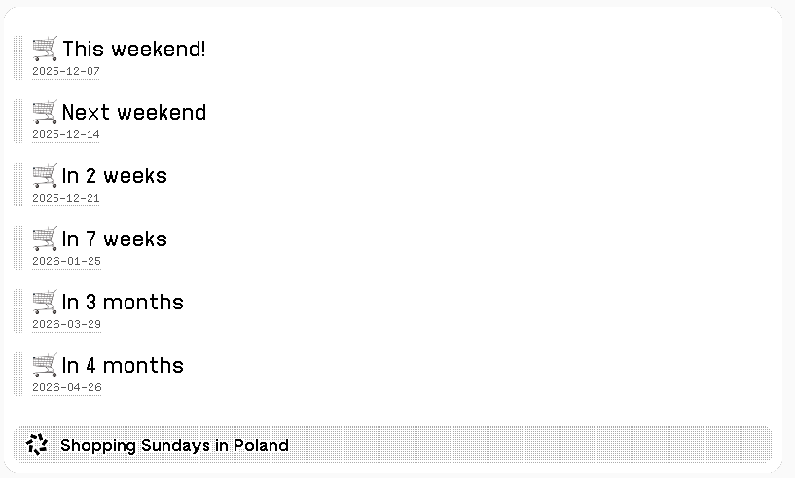

# Shopping Sundays in Poland

This is a recipe for a great e-ink dashboard called [TRMNL](https://usetrmnl.com/).

## 🇬🇧 English Description

A clear and convenient widget showing all upcoming Shopping Sundays in Poland.
The plugin automatically highlights the next available shopping day, displays how soon it is (e.g. This weekend, Next weekend, In 3 weeks), and adapts to your screen size to show the right number of entries.

Perfect for planning shopping trips, avoiding closed stores, and staying up-to-date with Poland’s retail calendar.

## 🇵🇱 Polski opis

Przejrzysty i wygodny widżet prezentujący wszystkie nadchodzące niedziele handlowe w Polsce.
Wtyczka automatycznie wyróżnia najbliższą niedzielę handlową, informuje ile czasu pozostało (np. W ten weekend, W przyszły weekend, Za 3 tygodnie) oraz dopasowuje liczbę wyświetlanych wpisów do rozmiaru ekranu.

Idealne narzędzie do planowania zakupów, unikania zamkniętych sklepów i pozostawania na bieżąco z polskim kalendarzem handlowym.

# How to import?

Import the [zip](plugin/private_plugin_189372.zip) on your [Plugins page](https://usetrmnl.com/plugin_settings?keyname=private_plugin).